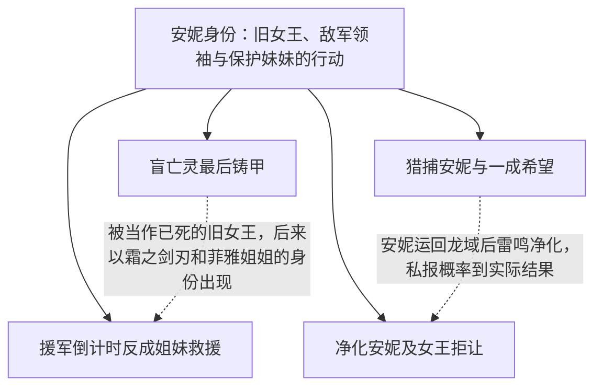

# 安妮身份：旧女王、敌军领袖与保护妹妹的行动

实线表示结构归属，虚线表示跨节点关系；依据类型详见节点数据。

```mermaid
flowchart TD
  n0["安妮身份：旧女王、敌军领袖与保护妹妹的行动"]
  n1["盲亡灵最后铸甲"]
  n0 --> n1
  n2["援军倒计时反成姐妹救援"]
  n0 --> n2
  n3["猎捕安妮与一成希望"]
  n0 --> n3
  n4["净化安妮及女王拒让"]
  n0 --> n4
  n3 -. "安妮运回龙域后雷鸣净化，私报概率到实际结果" .-> n4
  n1 -. "被当作已死的旧女王，后来以霜之剑刃和菲雅姐姐的身份出现" .-> n2
```

## 剧情线

- 安妮身份：旧女王、敌军领袖与保护妹妹的行动：hidden / resolved
