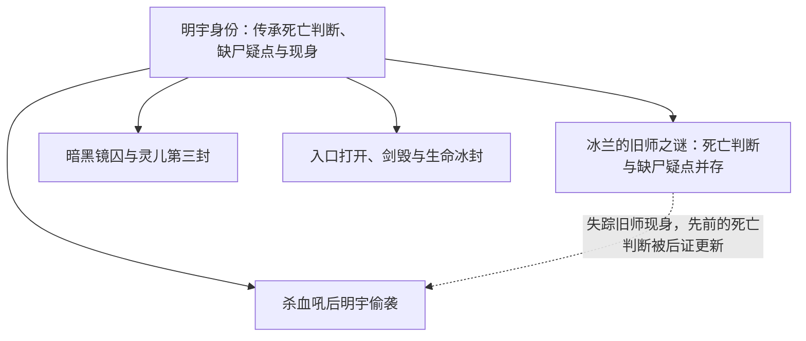

# 明宇身份：传承死亡判断、缺尸疑点与现身

实线表示结构归属，虚线表示跨节点关系；依据类型详见节点数据。

```mermaid
flowchart TD
  n0["明宇身份：传承死亡判断、缺尸疑点与现身"]
  n1["冰兰的旧师之谜：死亡判断与缺尸疑点并存"]
  n0 --> n1
  n2["暗黑镜囚与灵儿第三封"]
  n0 --> n2
  n3["杀血吼后明宇偷袭"]
  n0 --> n3
  n4["入口打开、剑毁与生命冰封"]
  n0 --> n4
  n1 -. "失踪旧师现身，先前的死亡判断被后证更新" .-> n3
```

## 剧情线

- 明宇身份：传承死亡判断、缺尸疑点与现身：hidden / resolved
