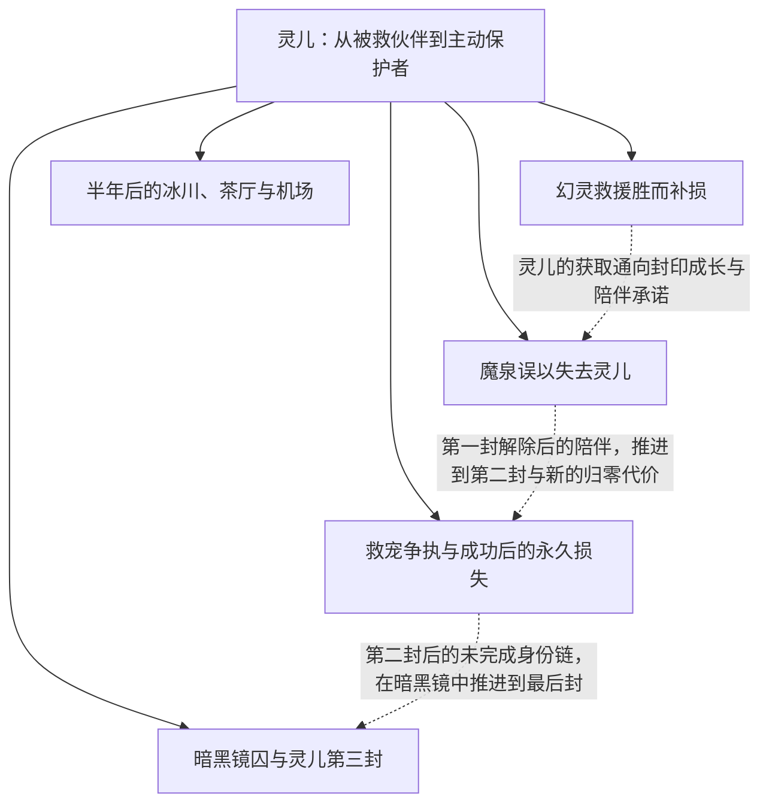

# 灵儿：从被救伙伴到主动保护者

实线表示结构归属，虚线表示跨节点关系；依据类型详见节点数据。

```mermaid
flowchart TD
  n0["灵儿：从被救伙伴到主动保护者"]
  n1["幻灵救援胜而补损"]
  n0 --> n1
  n2["魔泉误以失去灵儿"]
  n0 --> n2
  n3["救宠争执与成功后的永久损失"]
  n0 --> n3
  n4["暗黑镜囚与灵儿第三封"]
  n0 --> n4
  n5["半年后的冰川、茶厅与机场"]
  n0 --> n5
  n1 -. "灵儿的获取通向封印成长与陪伴承诺" .-> n2
  n2 -. "第一封解除后的陪伴，推进到第二封与新的归零代价" .-> n3
  n3 -. "第二封后的未完成身份链，在暗黑镜中推进到最后封" .-> n4
```

## 剧情线

- 灵儿：从被救伙伴到主动保护者：subplot / resolved
