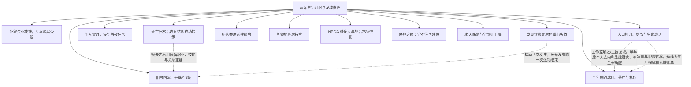

# 从谋生到组织与龙域责任

实线表示结构归属，虚线表示跨节点关系；依据类型详见节点数据。

```mermaid
flowchart TD
  n0["从谋生到组织与龙域责任"]
  n1["补叙失业缺钱，头盔购买受阻"]
  n0 --> n1
  n2["发现误绑定后仍赠出头盔"]
  n0 --> n2
  n3["加入雪月，接到首夜任务"]
  n0 --> n3
  n4["死亡归零后收到转职成功提示"]
  n0 --> n4
  n5["旧弓回流、带练回9级"]
  n0 --> n5
  n6["稻花香暗送建帮令"]
  n0 --> n6
  n7["首领地最后持令"]
  n0 --> n7
  n8["NPC战时全灭与战后75%恢复"]
  n0 --> n8
  n9["诸神之怒：守不住再建设"]
  n0 --> n9
  n10["凌天临终与全员迁上海"]
  n0 --> n10
  n11["入口打开、剑毁与生命冰封"]
  n0 --> n11
  n12["半年后的冰川、茶厅与机场"]
  n0 --> n12
  n4 -. "损失之后用保留职业、技能与关系重建" .-> n5
  n11 -. "工作室解散/主接龙域，半年后个人去向和重逢落实，冰兰未确醒" .-> n12
  n2 -. "援助再次发生，关系没有靠一次还礼结束" .-> n5
  n11 -. "冰封与职责转移，延续为每月探望和龙域账单" .-> n12
```

## 剧情线

- 从谋生到组织与龙域责任：main / partial
