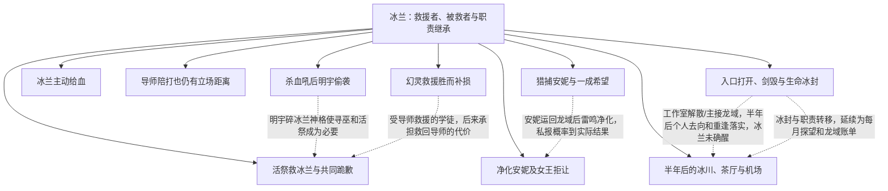

# 冰兰：救援者、被救者与职责继承

实线表示结构归属，虚线表示跨节点关系；依据类型详见节点数据。

```mermaid
flowchart TD
  n0["冰兰：救援者、被救者与职责继承"]
  n1["幻灵救援胜而补损"]
  n0 --> n1
  n2["冰兰主动给血"]
  n0 --> n2
  n3["导师陪打也仍有立场距离"]
  n0 --> n3
  n4["杀血吼后明宇偷袭"]
  n0 --> n4
  n5["活祭救冰兰与共同跪歉"]
  n0 --> n5
  n6["猎捕安妮与一成希望"]
  n0 --> n6
  n7["净化安妮及女王拒让"]
  n0 --> n7
  n8["入口打开、剑毁与生命冰封"]
  n0 --> n8
  n9["半年后的冰川、茶厅与机场"]
  n0 --> n9
  n4 -. "明宇碎冰兰神格使寻巫和活祭成为必要" .-> n5
  n6 -. "安妮运回龙域后雷鸣净化，私报概率到实际结果" .-> n7
  n8 -. "工作室解散/主接龙域，半年后个人去向和重逢落实，冰兰未确醒" .-> n9
  n1 -. "受导师救援的学徒，后来承担救回导师的代价" .-> n5
  n8 -. "冰封与职责转移，延续为每月探望和龙域账单" .-> n9
```

## 剧情线

- 冰兰：救援者、被救者与职责继承：subplot / partial
