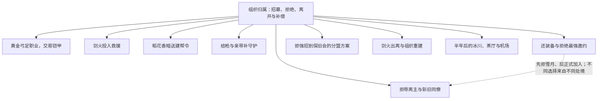

# 组织归属：招募、拒绝、离开与补偿

实线表示结构归属，虚线表示跨节点关系；依据类型详见节点数据。

```mermaid
flowchart TD
  n0["组织归属：招募、拒绝、离开与补偿"]
  n1["黄金弓定职业，交易铠甲"]
  n0 --> n1
  n2["剑火投入救援"]
  n0 --> n2
  n3["稻花香暗送建帮令"]
  n0 --> n3
  n4["给枪与亲带补守护"]
  n0 --> n4
  n5["还装备与拒绝最强邀约"]
  n0 --> n5
  n6["拒辱离主与斩旧同僚"]
  n0 --> n6
  n7["拒强招到保旧会的分盟方案"]
  n0 --> n7
  n8["剑火出离与组织重建"]
  n0 --> n8
  n9["半年后的冰川、茶厅与机场"]
  n0 --> n9
  n5 -. "先拒雪月、后正式加入；不同选择来自不同处境" .-> n6
```

## 剧情线

- 组织归属：招募、拒绝、离开与补偿：subplot / partial
