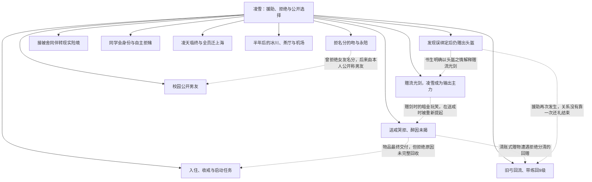

# 凌雪：援助、拒绝与公开选择

实线表示结构归属，虚线表示跨节点关系；依据类型详见节点数据。

```mermaid
flowchart TD
  n0["凌雪：援助、拒绝与公开选择"]
  n1["发现误绑定后仍赠出头盔"]
  n0 --> n1
  n2["赠流光剑，凌雪成为输出主力"]
  n0 --> n2
  n3["送戒哭拒、醉因未揭"]
  n0 --> n3
  n4["入住、收戒与启动任务"]
  n0 --> n4
  n5["旧弓回流、带练回9级"]
  n0 --> n5
  n6["拒名分的吻与永陪"]
  n0 --> n6
  n7["校园公开男友"]
  n0 --> n7
  n8["接被舍同伴转现实险境"]
  n0 --> n8
  n9["同学会身份与自主拒赌"]
  n0 --> n9
  n10["凌天临终与全员迁上海"]
  n0 --> n10
  n11["半年后的冰川、茶厅与机场"]
  n0 --> n11
  n1 -. "书生明确以头盔之情解释赠流光剑" .-> n2
  n3 -. "物品最终交付，但拒绝原因未完整回收" .-> n4
  n3 -. "清账式赠物遭遇拒绝分清的回赠" .-> n5
  n1 -. "援助再次发生，关系没有靠一次还礼结束" .-> n5
  n2 -. "赠剑时的暗金玩笑，在送戒时被重新提起" .-> n3
  n6 -. "曾拒绝女友名分，后来由本人公开称男友" .-> n7
```

## 剧情线

- 凌雪：援助、拒绝与公开选择：subplot / partial
