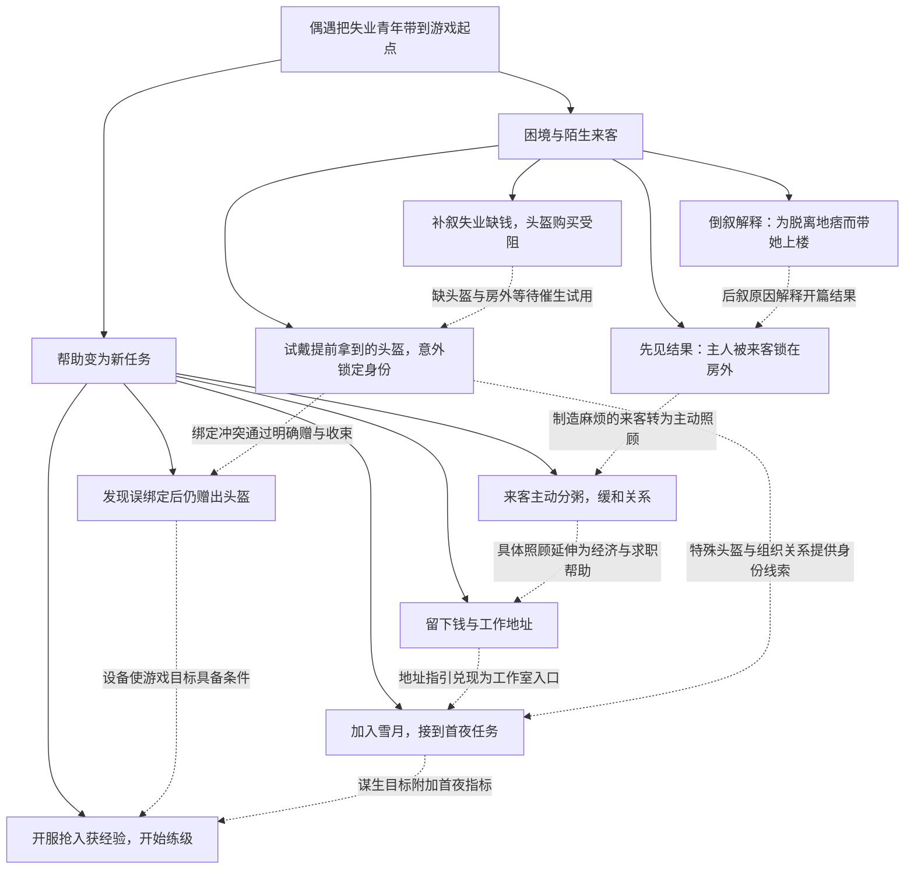

# 网游之纵横天下 · 卷一第1至5章实测

实线表示结构归属，虚线表示跨节点关系；依据类型详见节点数据。

```mermaid
flowchart TD
  n0["偶遇把失业青年带到游戏起点"]
  n1["困境与陌生来客"]
  n0 --> n1
  n2["帮助变为新任务"]
  n0 --> n2
  n3["先见结果：主人被来客锁在房外"]
  n1 --> n3
  n4["倒叙解释：为脱离地痞而带她上楼"]
  n1 --> n4
  n5["补叙失业缺钱，头盔购买受阻"]
  n1 --> n5
  n6["试戴提前拿到的头盔，意外锁定身份"]
  n1 --> n6
  n7["来客主动分粥，缓和关系"]
  n2 --> n7
  n8["发现误绑定后仍赠出头盔"]
  n2 --> n8
  n9["留下钱与工作地址"]
  n2 --> n9
  n10["加入雪月，接到首夜任务"]
  n2 --> n10
  n11["开服抢入获经验，开始练级"]
  n2 --> n11
  n4 -. "后叙原因解释开篇结果" .-> n3
  n5 -. "缺头盔与房外等待催生试用" .-> n6
  n3 -. "制造麻烦的来客转为主动照顾" .-> n7
  n6 -. "绑定冲突通过明确赠与收束" .-> n8
  n7 -. "具体照顾延伸为经济与求职帮助" .-> n9
  n9 -. "地址指引兑现为工作室入口" .-> n10
  n8 -. "设备使游戏目标具备条件" .-> n11
  n10 -. "谋生目标附加首夜指标" .-> n11
  n6 -. "特殊头盔与组织关系提供身份线索" .-> n10
```

## 剧情线

- 从现实窘境进入职业游戏：main / partial
- 由误会到相互帮助：subplot / partial
- 凌雪身份与提前拿到头盔的原因：hidden / open
