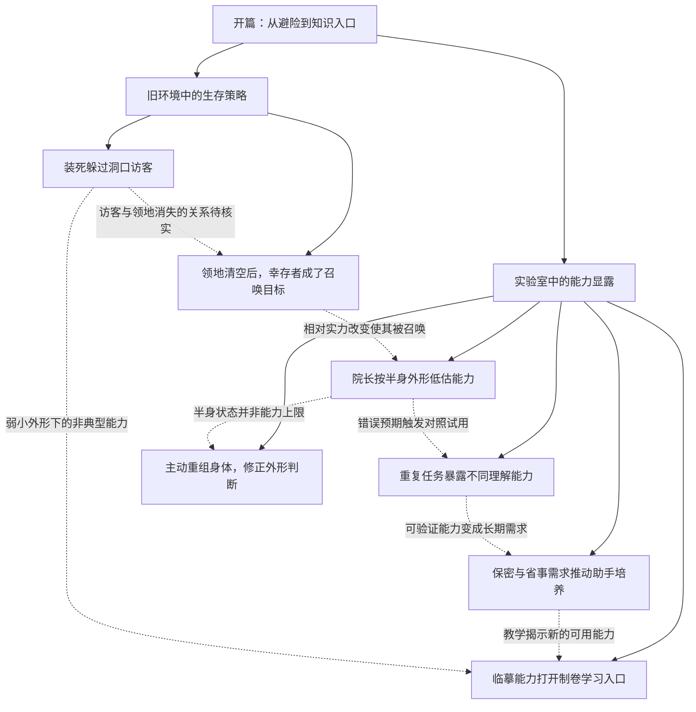

# 骷髅魔导师 · 第一至第四章实测

实线表示结构归属，虚线表示跨节点关系；依据类型详见节点数据。

```mermaid
flowchart TD
  n0["开篇：从避险到知识入口"]
  n1["旧环境中的生存策略"]
  n0 --> n1
  n2["实验室中的能力显露"]
  n0 --> n2
  n3["装死躲过洞口访客"]
  n1 --> n3
  n4["领地清空后，幸存者成了召唤目标"]
  n1 --> n4
  n5["院长按半身外形低估能力"]
  n2 --> n5
  n6["重复任务暴露不同理解能力"]
  n2 --> n6
  n7["主动重组身体，修正外形判断"]
  n2 --> n7
  n8["保密与省事需求推动助手培养"]
  n2 --> n8
  n9["临摹能力打开制卷学习入口"]
  n2 --> n9
  n3 -. "访客与领地消失的关系待核实" .-> n4
  n4 -. "相对实力改变使其被召唤" .-> n5
  n5 -. "错误预期触发对照试用" .-> n6
  n5 -. "半身状态并非能力上限" .-> n7
  n6 -. "可验证能力变成长期需求" .-> n8
  n8 -. "教学揭示新的可用能力" .-> n9
  n3 -. "弱小外形下的非典型能力" .-> n9
```

## 剧情线

- 进入实验室并获得学习入口：main / partial
- 半身外表掩盖的特殊能力：hidden / partial
- 魔族访客的目的与领地变故：hidden / unknown
