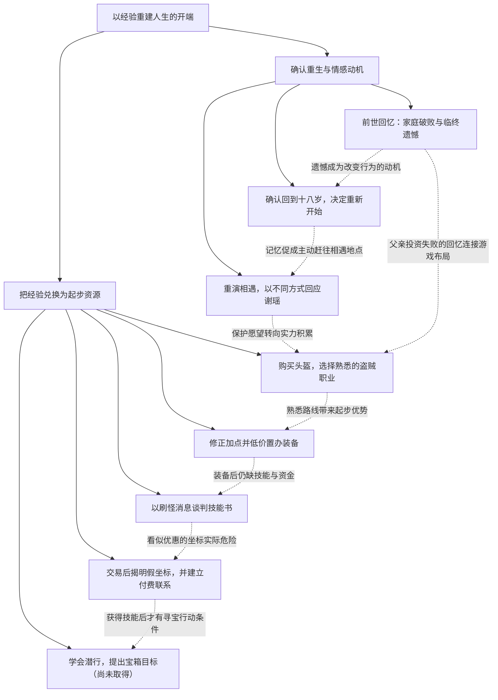

# 重生之贼行天下 · 第一至第四章实测

实线表示结构归属，虚线表示跨节点关系；依据类型详见节点数据。

```mermaid
flowchart TD
  n0["以经验重建人生的开端"]
  n1["确认重生与情感动机"]
  n0 --> n1
  n2["把经验兑换为起步资源"]
  n0 --> n2
  n3["前世回忆：家庭破败与临终遗憾"]
  n1 --> n3
  n4["确认回到十八岁，决定重新开始"]
  n1 --> n4
  n5["重演相遇，以不同方式回应谢瑶"]
  n1 --> n5
  n6["购买头盔，选择熟悉的盗贼职业"]
  n2 --> n6
  n7["修正加点并低价置办装备"]
  n2 --> n7
  n8["以刷怪消息谈判技能书"]
  n2 --> n8
  n9["交易后揭明假坐标，并建立付费联系"]
  n2 --> n9
  n10["学会潜行，提出宝箱目标（尚未取得）"]
  n2 --> n10
  n3 -. "遗憾成为改变行为的动机" .-> n4
  n4 -. "记忆促成主动赶往相遇地点" .-> n5
  n5 -. "保护愿望转向实力积累" .-> n6
  n3 -. "父亲投资失败的回忆连接游戏布局" .-> n6
  n6 -. "熟悉路线带来起步优势" .-> n7
  n7 -. "装备后仍缺技能与资金" .-> n8
  n8 -. "看似优惠的坐标实际危险" .-> n9
  n9 -. "获得技能后才有寻宝行动条件" .-> n10
```

## 剧情线

- 前世经验转化为当前资本：main / partial
- 改变曾经错失的关系：subplot / open
- 谈判中被隐藏的坐标风险：hidden / resolved
- 家庭危机与游戏投资的连接：hidden / open
