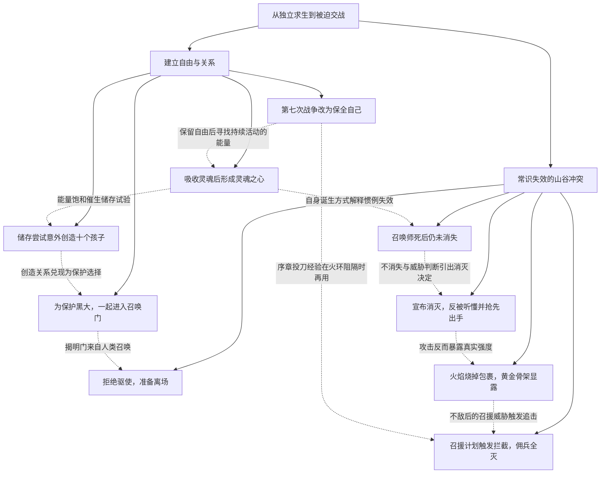

# 超级骷髅兵 · 序章至第二章实测

实线表示结构归属，虚线表示跨节点关系；依据类型详见节点数据。

```mermaid
flowchart TD
  n0["从独立求生到被迫交战"]
  n1["建立自由与关系"]
  n0 --> n1
  n2["常识失效的山谷冲突"]
  n0 --> n2
  n3["第七次战争改为保全自己"]
  n1 --> n3
  n4["吸收灵魂后形成灵魂之心"]
  n1 --> n4
  n5["储存尝试意外创造十个孩子"]
  n1 --> n5
  n6["为保护黑大，一起进入召唤门"]
  n1 --> n6
  n7["拒绝驱使，准备离场"]
  n2 --> n7
  n8["召唤师死后仍未消失"]
  n2 --> n8
  n9["宣布消灭，反被听懂并抢先出手"]
  n2 --> n9
  n10["火焰烧掉包裹，黄金骨架显露"]
  n2 --> n10
  n11["召援计划触发拦截，佣兵全灭"]
  n2 --> n11
  n3 -. "保留自由后寻找持续活动的能量" .-> n4
  n4 -. "能量饱和催生储存试验" .-> n5
  n5 -. "创造关系兑现为保护选择" .-> n6
  n6 -. "揭明门来自人类召唤" .-> n7
  n4 -. "自身诞生方式解释惯例失效" .-> n8
  n8 -. "不消失与威胁判断引出消灭决定" .-> n9
  n9 -. "攻击反而暴露真实强度" .-> n10
  n10 -. "不敌后的召援威胁触发追击" .-> n11
  n3 -. "序章投刀经验在火环阻隔时再用" .-> n11
```

## 剧情线

- 自由与保护推动走入外界：main / partial
- 惯常分类无法解释特殊骷髅：hidden / partial
- 战场求生经验的跨段回收：hidden / resolved
